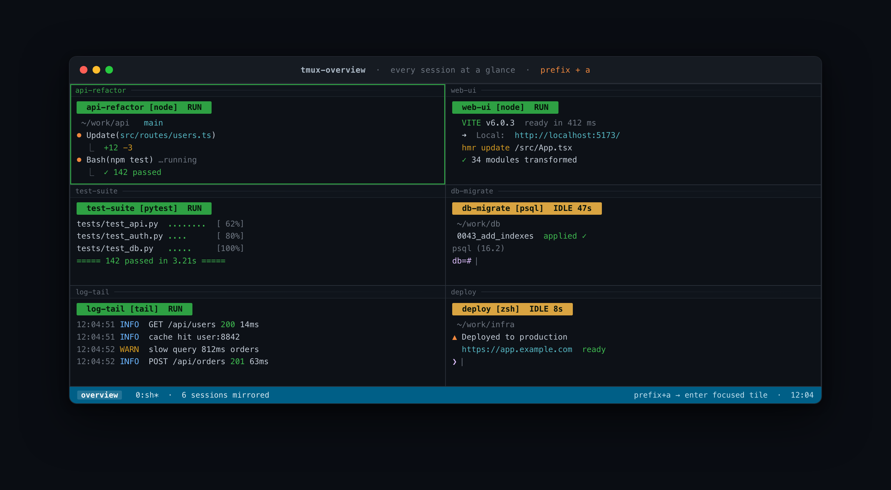

# tmux-overview

> 모든 tmux 세션을 한 화면에서 — 읽기전용 실시간 타일 대시보드 + 줌.

[English README](./README.md) · [설계 문서 (영문)](./docs/DESIGN.md)

여러 AI 코딩 에이전트(Claude Code 등)를 세션마다 하나씩 띄워 두면, 상태를 보려고 세션을 하나씩 넘겨 다녀야 합니다. **tmux-overview**는 모든 세션의 활성 pane을 타일 그리드 하나로 실시간 미러링해서, 누가 작업 중(**RUN**, 녹색)이고 누가 입력을 기다리는지(**IDLE Ns**, 노랑)를 한눈에 보여줍니다. 미러링은 순수 읽기전용이라 작업 세션에 어떤 영향(리사이즈·입력·중단)도 주지 않으며, 의존성 없는 POSIX 셸 스크립트 하나로 동작합니다.



<details>
<summary>텍스트 미리보기 (이미지가 안 뜨는 환경용)</summary>

```
┌ agent-api ────────────────────────┐┌ agent-web ────────────────────────┐
│ agent-api [node]  RUN             ││ agent-web [node]  IDLE 42s        │
│ ⏺ Running tests…                  ││ ❯ Plan ready. Proceed? (y/n)      │
└───────────────────────────────────┘└───────────────────────────────────┘
```

</details>

## 핵심 동작

- 타일마다 대상 세션의 활성 pane을 `tmux capture-pane -ep`로 약 1초 주기 미러 (ANSI 색 보존, 하단 정렬, 깜빡임 없음)
- 헤더에 세션명 + 실행 중인 명령 + 상태: 최근 3초 내 출력 있으면 **RUN**(녹색), 아니면 **IDLE Ns**(노랑), 세션이 사라지면 빨간 배너
- `session-created`/`session-closed` 전역 훅(인덱스 `[99]`, 기존 훅과 공존)으로 세션 생성/종료 시 타일 자동 추가/제거. 대시보드가 없어지면 훅은 스스로 해제
- 타일에 포커스를 두고 키 하나로 그 세션에 full-screen 진입(`switch-client` — 같은 클라이언트라 리사이즈 부작용 없음), 같은 키로 대시보드 복귀

## 요구사항

tmux **3.2 이상** (3.6에서 개발·검증), POSIX `sh`. macOS/Linux.

## 설치

```sh
mkdir -p ~/.local/bin
curl -fLo ~/.local/bin/overview.sh \
  https://raw.githubusercontent.com/justice-hwan/tmux-overview/main/overview.sh
chmod +x ~/.local/bin/overview.sh
```

키바인딩을 **tmux가 실제로 읽는 설정 파일**에 추가하세요. tmux 3.x는 `~/.config/tmux/tmux.conf`가 있으면 그걸 읽고 `~/.tmux.conf`는 무시합니다 (`prefix + a` 무반응 1위 원인). 파일 확인: `tmux display -p '#{config_files}'`.

```tmux
# tmux-overview (키는 자유롭게 변경 가능)
bind-key a     run-shell "$HOME/.local/bin/overview.sh toggle"   # 밖: 대시보드 열기 / 안: 포커스 타일 세션으로 진입
bind-key A     run-shell "$HOME/.local/bin/overview.sh rebuild"  # 강제 리빌드 (보통 불필요 — 자동 갱신됨)
bind-key Enter run-shell "$HOME/.local/bin/overview.sh zoom"     # 안: 포커스 타일 세션으로 진입
```

추가 후 리로드하고 등록 확인 (3줄 나와야 정상):

```sh
tmux source-file <위에서 확인한 파일>
tmux list-keys | grep overview.sh
```

TPM 사용자는 `set -g @plugin 'justice-hwan/tmux-overview'` 한 줄 후 `prefix + I`. 키 변경은 `@overview-key`, `@overview-rebuild-key`, `@overview-enter-key` 옵션으로.

## 사용 흐름

`prefix + a`로 열기 → 그리드 훑기 → 평소 pane 이동 키(또는 마우스)로 타일 포커스 → `prefix + a`(또는 `prefix + Enter`)로 진입 → 작업 → `prefix + a`로 복귀. 세션이 생기고 사라지는 것은 그리드가 알아서 따라갑니다.

## 설정 (환경변수)

| 변수 | 기본값 | 설명 |
|---|---|---|
| `OVERVIEW_SESSION` | `overview` | 대시보드 세션 이름 |
| `OVERVIEW_WIDTH` / `OVERVIEW_HEIGHT` | `188` / `53` | 대시보드 세션 생성 크기 (터미널 크기에 맞추면 타일 배치가 정확) |
| `OVERVIEW_IDLE_SEC` | `3` | RUN → IDLE 판정 기준 (초) |
| `OVERVIEW_INTERVAL` | `1` | 미러 갱신 주기 (초) |
| `OVERVIEW_EXCLUDE_SELF` | (미설정) | 설정 시 대시보드를 연 세션을 그리드에서 제외 (build 시점에만 적용) |

키바인딩에서 인라인으로 지정:

```tmux
bind-key a run-shell "OVERVIEW_WIDTH=220 OVERVIEW_HEIGHT=60 $HOME/.local/bin/overview.sh toggle"
```

세션 필터: `overview.sh build '^agent-'` — 패턴은 `@overview_filter` 세션 옵션에 저장되어 자동 갱신에도 유지됩니다.

## 한계 (정직하게)

- **읽기전용 + 최대 1초 지연.** 타일에서 입력·스크롤백 불가. 개입은 줌으로.
- 대상 세션이 타일보다 넓으면 긴 줄이 래핑됨. 실용 타일 수는 약 190×50 기준 **6~9개** (초과 시 경고 후 잔여 세션 스킵) — 필터 사용 권장.
- 각 세션의 **활성 window의 활성 pane**만 미러링.
- RUN/IDLE은 출력 기반 휴리스틱 (조용히 생각 중인 에이전트는 IDLE로 보임).
- `OVERVIEW_EXCLUDE_SELF`는 build 시점에만 적용 — 훅 자동 갱신이 런처 세션을 다시 추가할 수 있음 (지속 제외는 필터 패턴 사용).

## 문제 해결

**`prefix + a` 무반응.** 스크립트·tmux는 대개 정상이고, 키바인딩이 안 올라간 겁니다 (제일 흔한 설치 실수). 먼저 확인:

```sh
tmux list-keys | grep overview.sh   # 3줄 나와야 정상
```

- **아무것도 안 나옴** → 바인딩 미로드. 보통 설정을 tmux가 안 읽는 파일에 넣은 것: tmux 3.x는 `~/.config/tmux/tmux.conf`가 있으면 그걸 읽고 `~/.tmux.conf`는 무시합니다. `tmux display -p '#{config_files}'`로 진짜 파일을 찾아 거기에 넣고 `tmux source-file`. 도구 동작만 먼저 확인하려면 실행 중 tmux에 직접 바인딩: `tmux bind-key a run-shell "$HOME/.local/bin/overview.sh toggle"`.
- **3줄 나오는데도 안 됨** → prefix를 잘못 눌렀거나 키 충돌. `tmux show -g prefix`로 prefix 확인(기본 `C-b`) 후 그 prefix + `a`. `C-a`가 prefix면 `a`와 충돌할 수 있으니 다른 키로.

## 제거

```sh
# 1. 대시보드 세션 + 전역 훅 제거:
~/.local/bin/overview.sh kill

# 2. tmux 설정 파일에서 bind-key 3줄 삭제 후 리로드
#    (파일 경로 확인: tmux display -p '#{config_files}')

# 3. 스크립트 삭제:
rm ~/.local/bin/overview.sh
```

`overview.sh kill`을 안 하고 스크립트부터 지웠다면, 남은 훅은 수동으로:

```sh
tmux set-hook -gu 'session-created[99]'
tmux set-hook -gu 'session-closed[99]'
```

**TPM 사용자:** `set -g @plugin 'justice-hwan/tmux-overview'` 줄을 지우고 `prefix + alt + u`.

자세한 설계 근거는 [README.md](./README.md) · [docs/DESIGN.md](./docs/DESIGN.md).

## 라이선스

[MIT](./LICENSE) © 2026 justice-hwan
